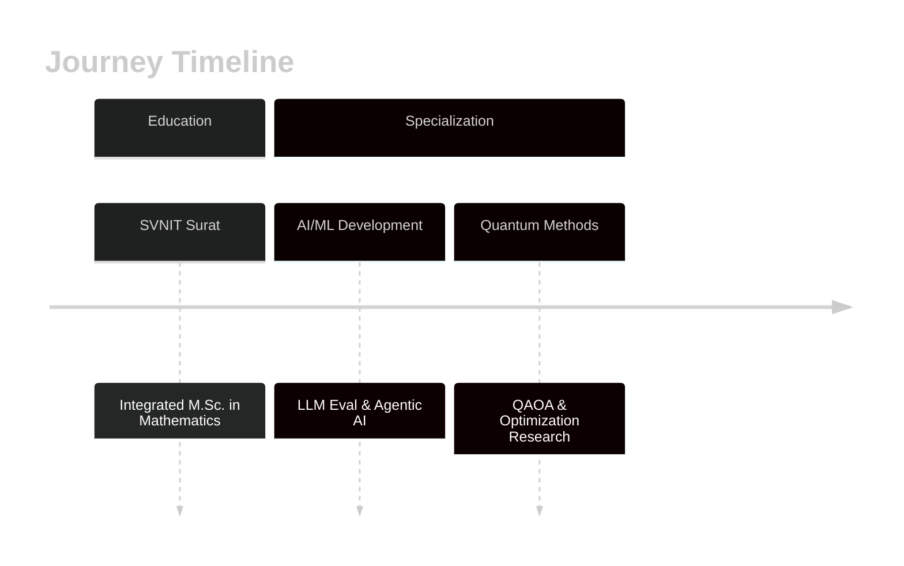

<!-- Wave Header Banner -->
<div align="center">
  <a target="_blank" href="https://github.com/kyechan99/capsule-render">
    
  </a>
</div>

<!-- Typing SVG Animation -->
<p align="center">
  <a href="https://git.io/typing-svg">
    
  </a>
</p>

<!-- Social Links & Counters -->
<p align="center">
  <a href="https://www.linkedin.com/in/anmol-kumar-srivastav-a2606b240/"></a>
  <a href="mailto:anmolala7@gmail.com"></a>
  <a target="_blank" href="https://github.com/komarev/github-readme-profile-counter"></a>
</p>

<hr>

## 👨‍💻 About Me

```python
class Anmol:
    def __init__(self):
        self.role = "AI/ML Engineer"
        self.education = {
            "degree": "Integrated M.Sc. in Mathematics",
            "university": "SVNIT, Surat",
            "focus": "Applied Math, Linear Algebra & Numerical Optimization"
        }
        self.expertise = [
            "LLM Evaluation Systems",
            "Agentic AI Workflows (LangGraph / Multi-Agent)",
            "RAG Pipelines",
            "Quantum Optimization (QAOA)",
            "Scalable Microservices"
        ]

    def current_focus(self):
        return [
            "Designing robust metrics for automated LLM evaluation",
            "Building multi-agent orchestration frameworks with dynamic DAG routing",
            "Optimizing combinatorial problems using QAOA",
            "Developing production-ready microservices with FastAPI & Docker"
        ]

    def note(self):
        # A quick disclaimer about production/internship projects
        return "Most of my production-grade engineering is under NDA!"
```

## 🚀 Highlights

* 🤖 **Agentic AI**: Specializing in complex multi-agent execution graphs, feedback loops, and workflows
* 🔒 **Enterprise Systems**: Developed low-latency, scalable AI systems in secure environments (under NDA)
* 📐 **Math Foundations**: Strong background in probability, numerical algorithms, optimization, and linear algebra
* 📊 **Microservices**: Focus on low-latency microservices, vectorized search, and cloud-native AI setups

## 💻 Tech Stack

### Languages & Core
<p>
  
  
  
  
  
</p>

### AI/ML & Orchestration
<p>
  
  
  
  
</p>

### Web, Databases & DevOps
<p>
  
  
  
  
  
</p>

## 🎯 Featured Projects

<table>
  <tr>
    <td width="50%">
      <h3 align="center">🤖 slm-council</h3>
      <p align="center">
        <a href="https://github.com/Aho-Bakaa/slm-council">
          
        </a>
      </p>
      <p align="center">
        
        
        
      </p>
      <p align="center">Many-to-One autonomous coding engine with a dynamic DAG orchestrator, specialist agents, and iterative refinement.</p>
    </td>
    <td width="50%">
      <h3 align="center">🔎 llm-observability</h3>
      <p align="center">
        <a href="https://github.com/Aho-Bakaa/llm_observability">
          
        </a>
      </p>
      <p align="center">
        
        
        
      </p>
      <p align="center">Real-time LLM pipeline validation, tracing, and evaluation observability.</p>
    </td>
  </tr>
  <tr>
    <td width="50%">
      <h3 align="center">⚡ EV Fleet Predictive Maintenance</h3>
      <p align="center">
        <a href="https://github.com/Aho-Bakaa/EV-Fleet-Predictive-maintenance">
          
        </a>
      </p>
      <p align="center">
        
        
        
      </p>
      <p align="center">Predictive maintenance and telemetry analysis engine for electric vehicle fleets.</p>
    </td>
    <td width="50%">
      <h3 align="center">🛡️ Sentinel Forge</h3>
      <p align="center">
        <a href="https://github.com/Aho-Bakaa/Sentinel-Forge">
          
        </a>
      </p>
      <p align="center">
        
        
        
      </p>
      <p align="center">Security monitoring, threat detection, and AI-driven log anomaly analysis.</p>
    </td>
  </tr>
</table>

## 💼 Journey



## 📊 GitHub Analytics

<p align="center">
  
  
</p>
<p align="center">
  
  
</p>

## 🌟 Quote of the Day
<div align="center">
  <a href="https://github.com/piyushsuthar/github-readme-quotes">
    
  </a>
</div>

<!-- Wave Footer Banner -->
<div align="center">
  <a target="_blank" href="https://github.com/kyechan99/capsule-render">
    
  </a>
</div>
```
